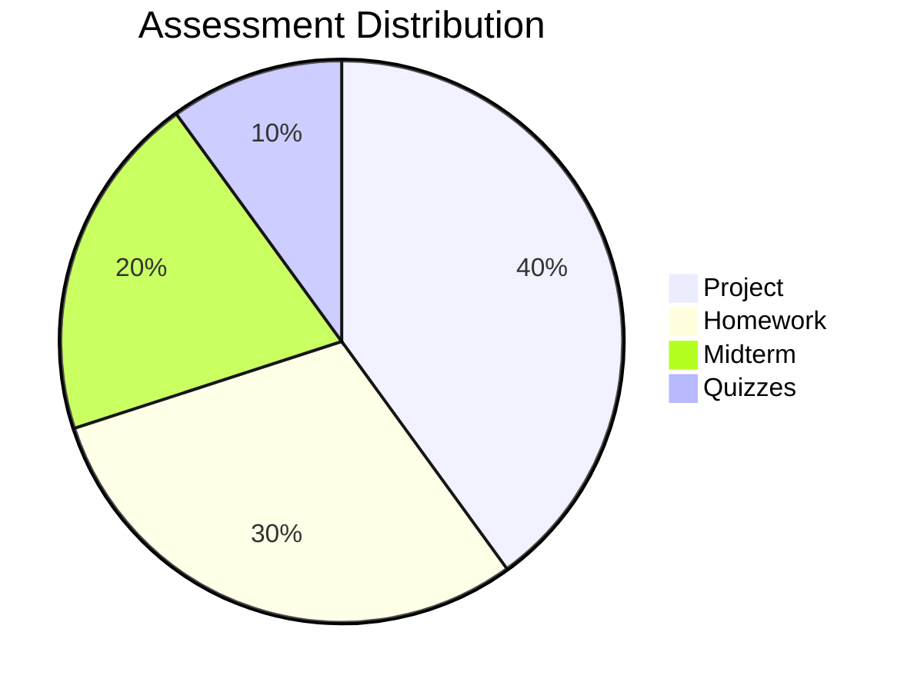

<style src="../style.css"></style>

# CSS 262: Linux Administration
## *nix Systems for Cybersecurity

<div class="pt-12">
  <span @click="$slidev.nav.next" class="px-2 py-1 rounded cursor-pointer" hover="bg-white bg-opacity-10">
    Lecture 1: Course Introduction & The Shell
  </span>
</div>

<div class="abs-br m-6 flex gap-2">
  <a href="https://github.com/yourusername/css262" target="_blank" alt="GitHub"
    class="text-xl slidev-icon-btn opacity-50 !border-none !hover:text-white">
    <carbon-logo-github />
  </a>
</div>

---
layout: default
---

# 👋 Welcome to CSS 262

<v-clicks>

- **What this course is about:** Linux Administration with a security-first approach
- **Who this course is for:** Future cybersecurity professionals
- **What you'll learn:** How to deploy, maintain, and secure Linux environments
- **Why it matters:** Essential skills for DevSecOps and Security Operations roles

</v-clicks>

<div v-click class="mt-8 p-4 bg-blue-500 bg-opacity-20 rounded">
💡 <strong>Key Philosophy:</strong> We focus on the "why" and "how" of system internals, not just commands to memorize.
</div>

---
layout: two-cols
---

# 📊 Course Details

**Course Code:** CSS 262  
**Duration:** 15 Weeks  
**Credits:** 5-6 ECTS  
**Level:** Undergraduate

<div class="mt-8">

### 🎯 Workload
- Lectures: 15 hours
- Labs: 30 hours
- Self-study: 45 hours
- Assignments: 16 hours
- Exams & Project: 32 hours

**Total: ~138 Hours**

</div>

::right::

<div class="ml-4">

### 📈 Grading Breakdown



<v-clicks>

- ✅ **Automated Grading** via GitHub Actions
- 🔄 Resubmissions allowed until deadline
- 🎯 Code must work on standard environment

</v-clicks>

</div>

---
layout: default
---

# 🎯 Course Learning Outcomes

<v-clicks>

1. **Administer** fundamental Linux components (users, permissions, storage, systemd)

2. **Develop** automated solutions using Bash scripting

3. **Configure** robust network settings and package management

4. **Harden** server security (SSH, firewalls, service management)

5. **Analyze** system logs and audit trails for security incidents

6. **Construct** production-ready infrastructure using IaC principles

</v-clicks>

---
layout: default
---

# 📅 Course Journey

<div class="grid grid-cols-2 gap-6 text-sm">

<div>

### Weeks 1-7: Foundations

- **Week 1:** Shell & VM Setup 🔧
- **Week 2:** Users & Permissions 👥
- **Week 3:** Processes & Systemd ⚙️
- **Week 4:** Storage & Filesystems 💾
- **Week 5:** Bash Scripting 📜
- **Week 6:** Networking Basics 🌐
- **Week 7:** Package Management 📦

</div>

<div>

### Weeks 8-15: Security Focus

- **Week 8:** 🔥 **Midterm Exam**
- **Week 9:** SSH Hardening 🔐
- **Week 10:** Firewalls 🛡️
- **Week 11:** SELinux/MAC 🔒
- **Week 12:** Logging & Auditing 📊
- **Week 13:** Docker Security 🐋
- **Week 14:** Vuln Scanning 🔍
- **Week 15:** 🎓 **Capstone Project**

</div>

</div>

---
layout: default
---

# 🧠 Skills You'll Acquire

<div class="grid grid-cols-2 gap-6 text-sm">

<div>

### Academic Skills

- 🧩 Problem-solving & troubleshooting
- 🤔 Critical thinking & root cause analysis
- 📚 Research skills & documentation
- 💻 Practical coding in Bash/Shell
- 🎯 Self-directed learning
- 🛡️ Security-first mindset

</div>

<div>

### Technical Skills

- Filesystem & permission management
- Security auditing scripts
- Firewall configuration
- Mandatory Access Control (SELinux)
- Log analysis & forensics
- Systemd & LVM administration

</div>

</div>

---
layout: default
---

# 📚 Required Resources

<div class="text-sm">

### 📖 Textbooks
1. **The Linux Command Line (2nd Edition)** - William Shotts
2. **UNIX and Linux System Administration Handbook (5th Edition)** - Evi Nemeth et al.
3. **PicoCTF Learning Primer** - For CTF-style challenges

### 💻 Hardware & Software
- **Laptop:** Minimum 8GB RAM
- **Virtualization:** VirtualBox or VMware
- **Tools:** Git, VS Code
- **Accounts:** GitHub (Free Educational Account)

</div>

<div class="mt-8 p-4 bg-yellow-500 bg-opacity-20 rounded">
⚠️ <strong>Important:</strong> You MUST have a working VM environment by next week's lab!
</div>

---
layout: center
class: text-center
---

# Part 2: The Shell

<div class="text-6xl mb-4">
🐚
</div>

Understanding the command-line interface

---
layout: default
---

# What is a Shell?

<div class="mb-8">

## Definition
The **shell** is a command-line interpreter that provides a user interface for accessing operating system services.

</div>

<div class="text-sm">

## Why Command Line?
- ⚡ **Power & Efficiency:** Automate repetitive tasks
- 🎯 **Precision:** Fine-grained control over system
- 🔄 **Reproducibility:** Script your actions
- 🌐 **Remote Access:** Manage systems over SSH
- 💪 **Professional Standard:** Industry-standard for sysadmin

</div>

---
layout: two-cols
---

# Shell Types

<v-clicks>

### Common Shells
- **bash** - Bourne Again Shell (Most common)
- **zsh** - Z Shell (Modern, feature-rich)
- **sh** - Original Bourne Shell
- **fish** - Friendly Interactive Shell
- **dash** - Debian Almquist Shell

</v-clicks>

<div v-click class="mt-6 p-3 bg-blue-500 bg-opacity-20 rounded">

**In this course:** We'll focus on **bash** (default on most Linux distributions)

</div>

::right::

<div class="ml-4">

<v-click>

### Check Your Shell

```bash
# See current shell
echo $SHELL

# List available shells
cat /etc/shells

# Change shell
chsh -s /bin/bash
```

</v-click>

<div v-click class="mt-6">

### Shell vs Terminal
- **Terminal:** The window/application
- **Shell:** The program running inside
- Think: Terminal = TV, Shell = Channel

</div>

</div>

---
layout: default
---

# The Command Prompt

<div class="mb-6">

```bash
user@hostname:~/directory$ command [options] [arguments]
```

</div>

<v-clicks>

<div class="grid grid-cols-2 gap-4 mb-6">

<div>

### Prompt Components
- `user` - Your username
- `hostname` - Computer name
- `~/directory` - Current location
- `$` - Regular user
- `#` - Root/superuser

</div>

<div>

### Special Paths
- `~` - Home directory
- `/` - Root directory
- `.` - Current directory
- `..` - Parent directory
- `-` - Previous directory

</div>

</div>

<div class="p-4 bg-green-500 bg-opacity-20 rounded">

💡 **Pro Tip:** The prompt can be customized via the `PS1` environment variable!

</div>

</v-clicks>

---
layout: default
---

# Essential Navigation Commands

<div class="grid grid-cols-2 gap-6">

<div>

<v-clicks>

### Moving Around
```bash
# Print working directory
pwd

# List contents
ls
ls -l    # Long format
ls -a    # Show hidden files
ls -lah  # All options combined

# Change directory
cd /etc
cd ~     # Go home
cd ..    # Go up one level
cd -     # Go to previous directory
```

</v-clicks>

</div>

<div>

<v-clicks>

### File Operations
```bash
# Create file
touch file.txt

# Copy files
cp source.txt dest.txt

# Move/rename
mv old.txt new.txt

# Delete
rm file.txt
rm -r directory/  # Recursive

# Create directory
mkdir new_folder
mkdir -p path/to/folder  # Parents
```

</v-clicks>

</div>

</div>

---
layout: default
---

# Getting Help

<v-clicks>

### 1. Manual Pages (man)
```bash
man ls        # Read the manual for ls
man man       # Learn about man itself!
```

### 2. Command Help
```bash
ls --help     # Quick help
help cd       # For built-in commands
```

### 3. Type and Which
```bash
type ls       # Show command type
which python  # Show command location
```

### 4. Info Pages
```bash
info coreutils     # GNU info system
```

</v-clicks>

<div v-click class="mt-4 p-4 bg-purple-500 bg-opacity-20 rounded">
🎓 <strong>Learning Skill:</strong> Reading man pages is a critical skill you'll use throughout your career!
</div>

---
layout: default
---

# File System Hierarchy

<div class="text-sm">

```
/                    Root directory
├── bin/            Essential user binaries
├── boot/           Boot loader files
├── dev/            Device files
├── etc/            System configuration
├── home/           User home directories
├── root/           Root user's home
├── tmp/            Temporary files
├── usr/            User programs
│   ├── bin/        User binaries
│   └── local/      Locally installed
└── var/            Variable data (logs, etc.)
```

</div>

<div class="mt-6 p-3 bg-blue-500 bg-opacity-20 rounded text-sm">
💡 <strong>Everything in Linux is a file!</strong> Including devices, processes, and network sockets.
</div>

---
layout: default
---

# Command Structure & Syntax

<div class="mb-6">

### Basic Anatomy
```bash
command [options] [arguments]
```

- **Command:** The program to run (e.g., `ls`, `cat`, `grep`)
- **Options:** Modify behavior (e.g., `-l`, `--all`, `-R`)
- **Arguments:** What to operate on (e.g., files, directories)

</div>

<div class="mb-6">

### Examples
```bash
ls -l /home/user              # List in long format
cp -r source/ destination/    # Copy recursively
grep -i "error" /var/log/syslog  # Case-insensitive
```

</div>

<div class="p-3 bg-yellow-500 bg-opacity-20 rounded text-sm">
⚠️ **Remember:** Options can be combined: `ls -lah` = `ls -l -a -h`
</div>

---
layout: default
---

# Keyboard Shortcuts

<div class="grid grid-cols-2 gap-4 text-sm">

<div>

### Navigation & Editing
- `Ctrl + A` / `Ctrl + E` - Line start/end
- `Ctrl + ←/→` - Jump by word
- `Ctrl + K` - Cut to end of line
- `Ctrl + U` - Cut to start of line
- `Ctrl + W` - Delete previous word

### Control
- `Ctrl + C` - Interrupt command
- `Ctrl + D` - Exit/logout
- `Ctrl + Z` - Suspend process
- `Ctrl + L` - Clear screen

</div>

<div>

### History Navigation
- `↑/↓` - Browse history
- `Ctrl + R` - Reverse search
- `history` - Show all commands
- `!!` - Repeat last command
- `!n` - Run command #n

### Pro Tips
- Press `Tab` for autocomplete
- Double `Tab` for all options
- `Esc + .` - Last argument

</div>

</div>

---
layout: default
---

# Viewing File Contents

<div class="text-sm">

### Basic Viewing
```bash
cat file.txt           # Display entire file
less file.txt          # Paginated viewer (q to quit)
head file.txt          # First 10 lines
head -n 20 file.txt    # First 20 lines
tail file.txt          # Last 10 lines
tail -f /var/log/syslog  # Follow in real-time
```

### Text Search
```bash
grep "pattern" file.txt           # Search for pattern
grep -r "error" /var/log/         # Recursive search
grep -i "warning" file.txt        # Case-insensitive
```

</div>

---
layout: default
---

# Pipes and Redirection

<div class="text-sm">

### Redirection Operators
```bash
command > file.txt       # Redirect output (overwrite)
command >> file.txt      # Redirect output (append)
command < file.txt       # Redirect input
command 2> errors.txt    # Redirect stderr
command &> all.txt       # Redirect stdout + stderr
```

### Pipes (|)
```bash
ls -l | grep ".txt"                    # List only .txt files
cat /var/log/syslog | grep error | less  # Chain commands
ps aux | grep apache | wc -l           # Count processes
```

</div>

<div class="mt-6 p-3 bg-green-500 bg-opacity-20 rounded text-sm">
💡 **Unix Philosophy:** Write programs that do one thing well and work together via pipes.
</div>

---
layout: default
---

# Wildcards & Pattern Matching

<div class="mb-6 text-sm">

### Glob Patterns
```bash
*           # Matches any characters
?           # Matches single character
[abc]       # Matches a, b, or c
[a-z]       # Matches any lowercase letter
[!abc]      # Matches anything except a, b, or c
```

### Examples
```bash
ls *.txt              # All .txt files
ls file?.txt          # file1.txt, fileA.txt, etc.
ls [a-c]*             # Files starting with a, b, or c
rm *~                 # Delete backup files
cp /etc/*.conf ./     # Copy all .conf files
```

</div>

<div class="p-3 bg-red-500 bg-opacity-20 rounded text-sm">
⚠️ **Warning:** Be careful with `rm *` - it deletes everything!
</div>

---
layout: default
---

# Environment Variables

<div class="mb-6 text-sm">

### What are they?
Variables that affect how processes run on your system.

```bash
# View variables
env                  # View all
echo $HOME           # View specific

# Set variable
MY_VAR="Hello"
export MY_VAR="Hello"  # Export for child processes
```

</div>

<div class="grid grid-cols-2 gap-4 text-sm">

<div>

### Common Variables
- `$HOME` - Home directory
- `$USER` - Username
- `$PATH` - Command search path
- `$SHELL` - Current shell
- `$PWD` - Current directory

</div>

<div>

### More Variables
- `$HOSTNAME` - Computer name
- `$LANG` - Language setting
- `$EDITOR` - Default editor
- `$PS1` - Prompt string

</div>

</div>

---
layout: default
---

# The PATH Variable

<div class="mb-6">

### What is PATH?
A colon-separated list of directories where the shell looks for commands.

```bash
echo $PATH
# /usr/local/bin:/usr/bin:/bin:/usr/sbin:/sbin
```

</div>

<div class="mb-6 text-sm">

### How it works
When you type `ls`, the shell searches directories in PATH order until found.

### Modifying PATH
```bash
# Add directory to PATH (at end)
export PATH=$PATH:/home/user/bin

# Add to beginning (higher priority)
export PATH=/home/user/bin:$PATH
```

</div>

---
layout: default
---

# File Permissions Preview

<v-clicks>

<div class="mb-6">

```bash
$ ls -l myfile.txt
-rw-r--r-- 1 user group 1234 Jan 28 10:00 myfile.txt
```

</div>

<div class="mb-6">

### Permission Breakdown
```
-  rw-  r--  r--
│  │    │    │
│  │    │    └─ Others: read only
│  │    └────── Group: read only
│  └─────────── Owner: read + write
└────────────── File type (- = regular file)
```

</div>

<div class="p-4 bg-blue-500 bg-opacity-20 rounded">

📝 **Note:** We'll dive deep into permissions in Week 2!

</div>

</v-clicks>

---
layout: default
---

# Lab 1 Preview: VM Setup

<div class="text-sm">

### What you'll do:
1. 🖥️ **Install VirtualBox/VMware** on your laptop
2. 📥 **Download Linux distribution** (Ubuntu Server recommended)
3. ⚙️ **Create and configure VM** (minimum specs provided)
4. 🚀 **First boot and initial setup**
5. 🐚 **Practice shell navigation commands**

### Deliverables:
- Screenshot of successful VM boot
- Output of basic commands (`pwd`, `ls`, `whoami`)
- Create a directory structure using `mkdir`

**Time Estimate:** 2 hours

</div>

<div class="mt-6 p-3 bg-green-500 bg-opacity-20 rounded text-sm">
✅ <strong>Goal:</strong> Have a working Linux environment ready for Week 2!
</div>

---
layout: default
---

# Tips for Success

<div class="grid grid-cols-2 gap-4 text-sm">

<div>

### Learning Strategies
- 📖 Read error messages carefully
- 🔍 Use `man` pages before Googling
- 💻 Practice daily, even 15 minutes
- 🎯 Type commands, don't copy-paste
- 📝 Keep a command journal
- 🤝 Form study groups

</div>

<div>

### Common Pitfalls
- ❌ Ignoring case sensitivity
- ❌ Forgetting `sudo` when needed
- ❌ Not reading documentation
- ❌ Running `rm -rf` carelessly
- ❌ Hardcoding values in scripts
- ❌ Not testing before submission

</div>

</div>

<div class="mt-8 p-3 bg-purple-500 bg-opacity-20 rounded text-sm">
🎓 <strong>Remember:</strong> The goal isn't memorization—it's understanding how the system works!
</div>

---
layout: default
---

# Automated Grading System

<div class="mb-6 text-sm">

### How It Works
- All assignments submitted via **GitHub**
- **GitHub Actions** runs automated tests
- Tests use **dynamic inputs** (no hardcoding!)
- You'll see results instantly: ✅ or ❌

### Grading Philosophy
```
✅ Green Checkmark = Full Points
❌ Red Cross = Zero Points (but you can resubmit!)
```

**Key Rule:** Code must work on the grading environment, not just "on your machine"

</div>

<div class="p-3 bg-yellow-500 bg-opacity-20 rounded text-sm">
⚠️ <strong>Anti-Cheat:</strong> Midterm flags are cryptographically tied to YOUR GitHub username!
</div>

---
layout: default
---

# Important Dates & Deadlines

<div class="grid grid-cols-2 gap-6">

<div>

### Homework Deadlines
- **Homework 1:** Week 3
- **Homework 2:** Week 6
- **Homework 3:** Week 11
- **Homework 4:** Week 14

### Quizzes
- **Quiz 1:** Week 7
- **Quiz 2:** Week 12

</div>

<div>

### Major Assessments
- **Midterm Exam:** Week 8
  - "Broken VM" Challenge
  - 4 hours
  - 20% of grade

- **Capstone Project:** Week 15
  - Infrastructure deployment
  - Defense presentation
  - 40% of grade

</div>

</div>

<div v-click class="mt-6 p-4 bg-red-500 bg-opacity-20 rounded">

⏰ <strong>No Extensions:</strong> Late work not accepted. Plan accordingly!

</div>

---
layout: default
---

# Resources & Support

<div class="text-sm">

### 📚 Course Materials
- **LMS:** All lectures, labs, and assignments
- **GitHub Org:** Starter code and submissions
- **Discussion Forum:** Ask questions, help peers

### 🆘 Getting Help
1. **Office Hours:** TBD (to be announced)
2. **Lab Sessions:** Hands-on assistance during lab time
3. **Discussion Forum:** Community support
4. **Documentation:** Man pages, official docs

### 🔗 Useful Links
- Course GitHub: `github.com/your-org/css262`
- Linux docs: `linux.die.net`
- Bash guide: `mywiki.wooledge.org/BashGuide`

</div>

---
layout: default
---

# Week 1 Action Items

<div class="text-sm">

### ✅ Before Next Lecture:
1. Read **Chapter 1-3** of "The Linux Command Line"
2. Set up **GitHub account** (if you don't have one)
3. Join course **GitHub Organization** (link on LMS)
4. Review VM requirements (8GB RAM minimum)

### ✅ For Lab This Week:
1. Install **VirtualBox** or VMware
2. Download **Ubuntu Server ISO** (link provided)
3. Bring laptop with **at least 20GB free space**
4. Complete **Lab 1: VM Setup & Shell Navigation**

### 📝 Optional:
- Explore `man` pages for basic commands
- Try shell navigation on your own

</div>

---
layout: center
class: text-center
---

# Questions?

<div class="text-8xl mb-8">
❓
</div>

<v-clicks>

**Remember:** There are no stupid questions!

The shell can be intimidating at first, but you'll be comfortable in no time.

</v-clicks>

<div v-click class="mt-8">

**Next Week:** Users, Groups & Permissions 👥🔐

</div>

---
layout: end
class: text-center
---

# Thank You!

<div class="text-6xl mb-8">
🐧
</div>

**See you in the lab!**

Start your Linux journey today 🚀

<div class="mt-8 text-sm opacity-75">
CSS 262 - Linux Administration & *nix Systems for Cybersecurity
</div>
